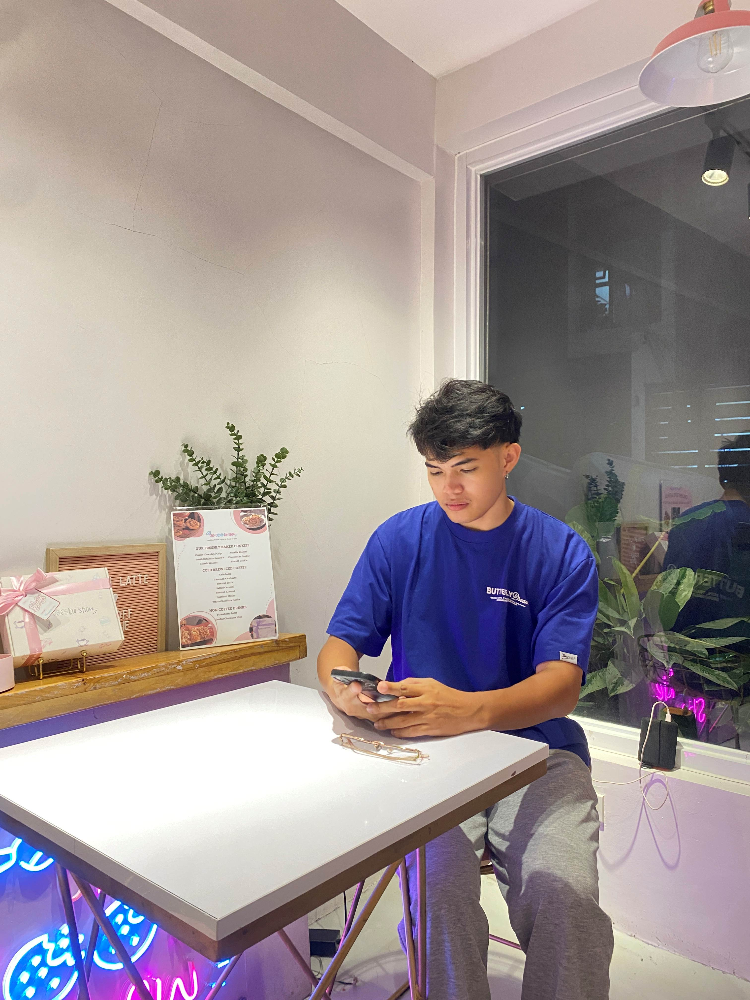
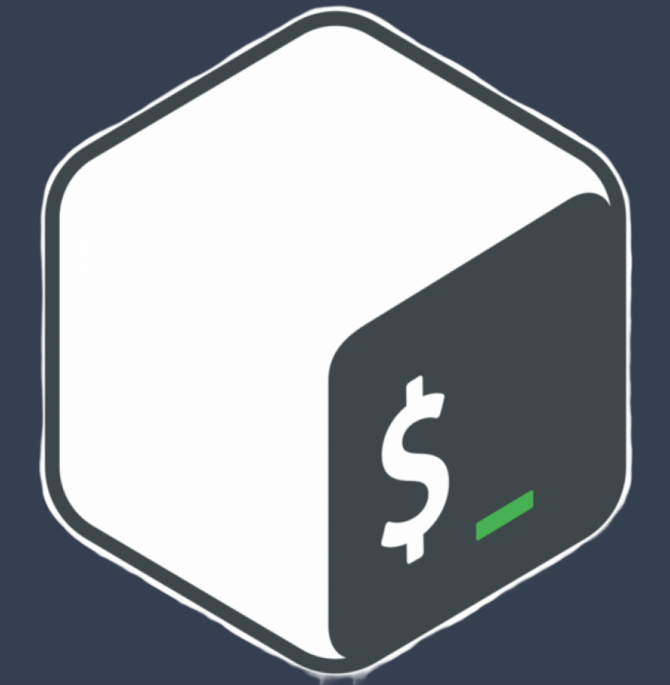

<html lang="en">
<head>
    <meta charset="UTF-8">
    <meta name="viewport" content="width=device-width, initial-scale=1.0">
    <title>Telan, Monique - Portfolio </title>
    
    <link href="https://fonts.googleapis.com/css2?family=Inter:wght@400;500;600;700;900&display=swap" rel="stylesheet">
    
</head>
<body class="antialiased">

    <header class="py-4 md:py-6 sticky top-0 z-50 bg-gray-900/80 backdrop-blur-md shadow-lg">
        

            <a href="#home" class="text-2xl sm:text-3xl font-bold text-white whitespace-nowrap">My Portfolio</a>
            
            <button id="mobile-menu-button" class="md:hidden p-2 rounded-md text-gray-300 hover:text-white focus:outline-none focus:ring-2 focus:ring-inset focus:ring-green-500" aria-controls="mobile-menu" aria-expanded="false">
                Open main menu
                <svg class="block h-6 w-6" xmlns="http://www.w3.org/2000/svg" fill="none" viewBox="0 0 24 24" stroke="currentColor" aria-hidden="true">
                    <path stroke-linecap="round" stroke-linejoin="round" stroke-width="2" d="M4 6h16M4 12h16M4 18h16" />
                </svg>
                <svg class="hidden h-6 w-6" xmlns="http://www.w3.org/2000/svg" fill="none" viewBox="0 0 24 24" stroke="currentColor" aria-hidden="true">
                    <path stroke-linecap="round" stroke-linejoin="round" stroke-width="2" d="M6 18L18 6M6 6l12 12" />
                </svg>
            </button>

            <nav id="mobile-menu" class="hidden w-full md:flex md:w-auto md:items-center mt-2 md:mt-0">
                <ul class="flex flex-col md:flex-row md:space-x-4 lg:space-x-6 items-start md:items-center text-sm sm:text-base">
                    <li><a href="#home" class="nav-link block py-2 px-3 md:p-1 lg:p-2 text-gray-300 hover:text-green-400 transition-colors duration-300 active">Home</a></li>
                    <li><a href="#resume" class="nav-link block py-2 px-3 md:p-1 lg:p-2 text-gray-300 hover:text-green-400 transition-colors duration-300">Resume</a></li>
                    <li><a href="#skills" class="nav-link block py-2 px-3 md:p-1 lg:p-2 text-gray-300 hover:text-green-400 transition-colors duration-300">Skills</a></li>
                    <li><a href="#projects" class="nav-link block py-2 px-3 md:p-1 lg:p-2 text-gray-300 hover:text-green-400 transition-colors duration-300">Projects</a></li>
                    <li><a href="#tools" class="nav-link block py-2 px-3 md:p-1 lg:p-2 text-gray-300 hover:text-green-400 transition-colors duration-300"> Tools & Languages</a></li>
                    <li><a href="#contact" class="nav-link block py-2 px-3 md:p-1 lg:p-2 text-gray-300 hover:text-green-400 transition-colors duration-300">Contact</a></li>
                </ul>
            </nav>
        

    </header>

    <main>
        <section id="home" class="hero-section relative min-h-screen flex items-center overflow-hidden py-10 sm:py-12 md:py-16">
            

                

                    

                        
Hi There!

                        <h1 class="text-4xl sm:text-5xl md:text-6xl lg:text-7xl font-extrabold text-white mb-3 sm:mb-4 leading-tight">
                            I'm Monique Telan
                        </h1>
                        

                            Software Developer | DevOps Enthusiast
                        

                        <a href="#contact" class="cta-button text-white font-semibold py-3 px-6 sm:px-8 rounded-lg text-base sm:text-lg inline-block shadow-md hover:shadow-lg transform hover:scale-105">
                            Send me a message
                        </a>
                    

                    

                        
                        
 

                        

                    

                

            

        </section>

        <section id="resume" class="content-section bg-gray-800">
            

                <h2 class="text-2xl sm:text-3xl md:text-4xl font-bold text-center mb-6 sm:mb-8 md:mb-12 text-white">My Resume</h2>
        
                

                    <a href="CV-TELAN.pdf"
                       download="CV-TELAN.pdf" class="cta-button text-white font-semibold py-3 px-6 sm:px-8 rounded-lg text-base sm:text-lg inline-block shadow-md hover:shadow-lg transform hover:scale-105 transition-all duration-300">
                        <svg xmlns="http://www.w3.org/2000/svg" class="h-5 w-5 inline-block mr-2 -mt-1" viewBox="0 0 20 20" fill="currentColor">
                            <path fill-rule="evenodd" d="M3 17a1 1 0 011-1h12a1 1 0 110 2H4a1 1 0 01-1-1zm3.293-7.707a1 1 0 011.414 0L9 10.586V3a1 1 0 112 0v7.586l1.293-1.293a1 1 0 111.414 1.414l-3 3a1 1 0 01-1.414 0l-3-3a1 1 0 010-1.414z" clip-rule="evenodd" />
                        </svg>
                        Download CV-TELAN  (PDF)
                    </a>
                

        
                

        </section>

        <section id="skills" class="content-section bg-gray-700">
            

                <h2 class="text-2xl sm:text-3xl md:text-4xl font-bold text-center mb-6 sm:mb-8 md:mb-12 text-white">Skills</h2>
                

                    Beyond specific tools and languages, here are some of the key competencies and methodologies I will bring to the table.
                

        
                

        
                    

                        <h3 class="text-xl font-semibold text-green-400 mb-4">Soft Skills</h3>
                        <ul class="list-disc list-inside text-gray-300 space-y-2">
                            <li>Effective Communication (Written & Verbal)</li>
                            <li>Problem-Solving & Analytical Thinking</li>
                            <li>Teamwork & Collaboration</li>
                            <li>Adaptability & Quick Learning</li>
                            <li>Attention to Detail</li>
                            </ul>
                    

        
                    

                        <h3 class="text-xl font-semibold text-green-400 mb-4">Methodologies & Practices</h3>
                        <ul class="list-disc list-inside text-gray-300 space-y-2">
                            <li>Agile Development Principles</li>
                            <li>Scrum Framework</li>
                            <li>DevOps Culture & Collaboration</li>
                            <li>Version Control (Git) Workflows</li>
                            <li>Object-Oriented Design</li>
                            <li>Tecnical Documentation</li>
                            </ul>
                    

        
                    

            

        </section>

        <section id="projects" class="content-section bg-gray-800">
            

                <h2 class="text-2xl sm:text-3xl md:text-4xl font-bold text-center mb-6 sm:mb-8 md:mb-12 text-white">Projects</h2>
                
Showcase your projects here. Include descriptions, images, and links.

            

        </section>

        <section id="tools" class="content-section bg-gray-700">
            

                <h2 class="text-2xl sm:text-3xl md:text-4xl font-bold text-center mb-6 sm:mb-8 md:mb-12 text-white">Tools & Languages</h2>
                
Here are the tools and programming languages that I know. 

                

                    

                        
                        <h3 class="text-sm sm:text-base md:text-lg font-semibold mt-1 sm:mt-2">Java</h3>
                    

                    

                        
                        <h3 class="text-sm sm:text-base md:text-lg font-semibold mt-1 sm:mt-2">Python</h3>
                    

                    

                        
                        <h3 class="text-sm sm:text-base md:text-lg font-semibold mt-1 sm:mt-2">HTML</h3>
                    

                    

                        
                        <h3 class="text-sm sm:text-base md:text-lg font-semibold mt-1 sm:mt-2">CSS</h3>
                    

                    

                        
                        <h3 class="text-sm sm:text-base md:text-lg font-semibold mt-1 sm:mt-2">Linux</h3>
                    

                    

                        
                        <h3 class="text-sm sm:text-base md:text-lg font-semibold mt-1 sm:mt-2">Bash</h3>
                    

                    

                        
                        <h3 class="text-sm sm:text-base md:text-lg font-semibold mt-1 sm:mt-2">GIT</h3>
                    

                    

                        
                        <h3 class="text-sm sm:text-base md:text-lg font-semibold mt-1 sm:mt-2">MySQL</h3>
                    

                

            

        </section>

        <section id="contact" class="content-section bg-gray-800 py-10 sm:py-12 md:py-16">
            

                <h2 class="text-2xl sm:text-3xl md:text-4xl font-bold text-center mb-3 sm:mb-4 text-white"> Contact Details</h2>
                
 
                
 
                    Feel free to reach out through any of the methods below.
                

                

                    

                        <h3 class="text-sm sm:text-base md:text-lg font-semibold text-green-400 uppercase tracking-wider mb-1 sm:mb-2">Email</h3> 
                        <a href="mailto:nickotelan3@gmail.com" class="text-base sm:text-lg md:text-xl text-gray-200 hover:text-white transition-colors break-all">nickotelan3@gmail.com</a>
                    

                    

                        <h3 class="text-sm sm:text-base md:text-lg font-semibold text-green-400 uppercase tracking-wider mb-1 sm:mb-2">Phone</h3>
                        <a href="tel:+639123924549" class="text-base sm:text-lg md:text-xl text-gray-200 hover:text-white transition-colors">+639123924549</a>
                    

                    

                        <h3 class="text-sm sm:text-base md:text-lg font-semibold text-green-400 uppercase tracking-wider mb-1 sm:mb-2">Location</h3>
                        
Pembo, Taguig City 

                    

                

            

        </section>
    </main>

    <footer class="text-center py-6 sm:py-8 bg-gray-900">
        
&copy;  Telan, Monique. All rights reserved.
 
    </footer>

    

</body>
</html>
