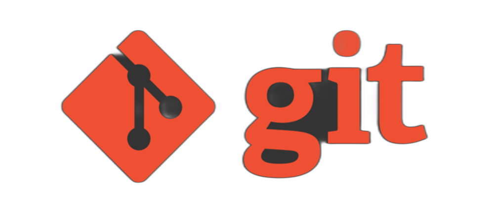

<html lang="en">
<head>
    <meta charset="UTF-8">
    <meta name="viewport" content="width=device-width, initial-scale=1.0">
    <title> My Website Portfolio </title>
    
    <link href="https://fonts.googleapis.com/css2?family=Inter:wght@400;500;600;700;900&display=swap" rel="stylesheet">
    
</head>
<body class="antialiased">

    <header class="py-6 sticky top-0 z-50 bg-gray-900/80 backdrop-blur-md shadow-lg">
        

            <a href="#home" class="text-3xl font-bold text-white"> My Portfolio 
            </a>
            <nav>
                <ul class="flex space-x-6 md:space-x-8 items-center">
                    <li><a href="#home" class="nav-link text-gray-300 hover:text-green-400 transition-colors duration-300 active">Home</a></li>
                    <li><a href="#resume" class="nav-link text-gray-300 hover:text-green-400 transition-colors duration-300">Resume</a></li>
                    <li><a href="#skills" class="nav-link text-gray-300 hover:text-green-400 transition-colors duration-300">Skills</a></li>
                    <li><a href="#projects" class="nav-link text-gray-300 hover:text-green-400 transition-colors duration-300">Projects</a></li>
                    <li><a href="#tools" class="nav-link text-gray-300 hover:text-green-400 transition-colors duration-300">Languages & Tools</a></li>
                    <li><a href="#contact" class="nav-link text-gray-300 hover:text-green-400 transition-colors duration-300">Contact</a></li>
                </ul>
            </nav>
        

    </header>

    <main>
        <section id="home" class="hero-section relative min-h-screen flex items-center overflow-hidden">
            

                

                    

                        
Hi There!

                        <h1 class="text-5xl sm:text-6xl md:text-7xl font-extrabold text-white mb-4 leading-tight">
                            I'm Monique Telan
                        </h1>
                        

                            A future DevOps Engineer.
                        

                        <a href="#contact" class="cta-button text-white font-semibold py-3 px-8 rounded-lg text-lg inline-block shadow-md hover:shadow-lg transform hover:scale-105">
                            Send me a message
                        </a>
                    

                    

                        
                        
 

                        

                    

                    

            

        </section>

        <section id="resume" class="content-section bg-gray-800">
            

                <h2 class="text-4xl font-bold text-center mb-12 text-white">My Resume</h2>
                
Resume content will go here. You can embed a PDF, list experiences, etc.

                

        </section>

        <section id="skills" class="content-section bg-gray-700">
            

                <h2 class="text-4xl font-bold text-center mb-12 text-white">Skills</h2>
                
Here are the tools and programming languages that I know. 

                

                

                        
                        <h3 class="text-xl font-semibold mt-2">Java</h3>
                    

                    

                        
                        <h3 class="text-xl font-semibold mt-2">Python</h3>
                    

                    

                        
                        <h3 class="text-xl font-semibold mt-2">HTML</h3>
                    

                    

                        
                        <h3 class="text-xl font-semibold mt-2">CSS</h3>
                    

                    

                        
                        <h3 class="text-xl font-semibold mt-2">Linux</h3>
                    

                    

                        
                        <h3 class="text-xl font-semibold mt-2">Bash</h3>
                    

                    

                        
                        <h3 class="text-xl font-semibold mt-2">GIT</h3>
                    

                    

                        
                        <h3 class="text-xl font-semibold mt-2">MySQL</h3>
                    

                

            

        </section>

        <section id="projects" class="content-section bg-gray-800">
            

                <h2 class="text-4xl font-bold text-center mb-12 text-white">Projects</h2>
                
Showcase your projects here. Include descriptions, images, and links.

                

        </section>

        <section id="tools" class="content-section bg-gray-700">
            

                <h2 class="text-4xl font-bold text-center mb-12 text-white">Languages & Tools</h2>
                
List any events, hackathons, workshops, or other participations here.

                

        </section>

        <section id="contact" class="contact-bar py-12 md:py-16">
            

                

                    

                        <h3 class="text-sm font-semibold text-gray-400 uppercase tracking-wider mb-1">Email</h3>
                        <a href="mailto:nickotelan3@gmail.com" class="text-lg text-green-400 hover:text-green-300 transition-colors">nickotelan3@gmail.com</a>
                    

                    

                        <h3 class="text-sm font-semibold text-gray-400 uppercase tracking-wider mb-1">Phone</h3>
                        <a href="tel:+639123924549" class="text-lg text-green-400 hover:text-green-300 transition-colors">+639123924549</a>
                    

                    

                        <h3 class="text-sm font-semibold text-gray-400 uppercase tracking-wider mb-1">Location</h3>
                        
Pembo, Taguig City 

                    

                

            

        </section>
    </main>

    <footer class="text-center py-8 bg-gray-900">
        
&copy;  Telan, Monique. All rights reserved.
 </footer>

    

</body>
</html>
